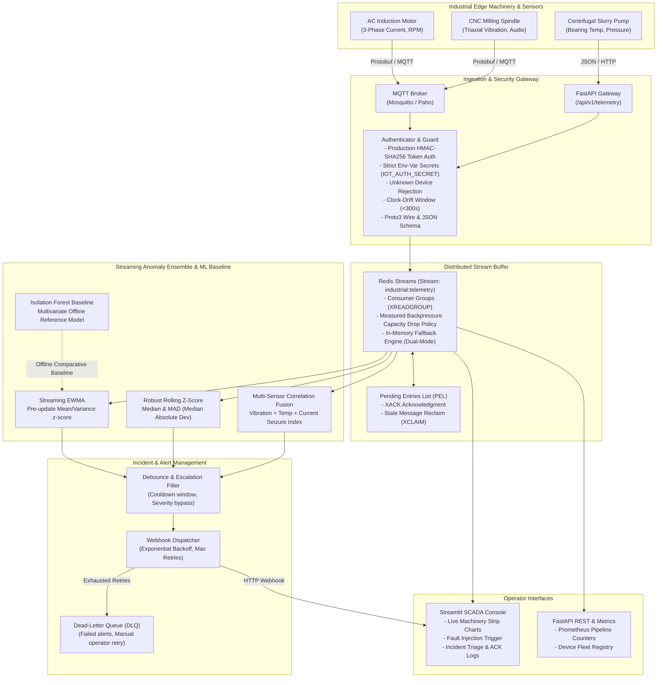

# Industrial Edge Telemetry & Streaming Anomaly Detection Platform

[](https://github.com/emirhankaya-AFK/industrial-iot-telemetry-platform/actions/workflows/ci.yml)
[](https://www.python.org/)
[](https://fastapi.tiangolo.com/)
[](https://streamlit.io/)
[](https://redis.io/)
[](https://protobuf.dev/)
[](https://github.com/astral-sh/ruff)
[](https://opensource.org/licenses/MIT)

An industrial-grade edge telemetry ingestion and real-time streaming anomaly detection platform designed for mission-critical cyber-physical systems (AC induction motors, high-speed CNC spindles, and centrifugal pumps).

The platform ingests high-frequency sensor streams (3-phase current, triaxial vibration, bearing temperature, RPM, acoustic noise) over **MQTT** and **HTTP**, validates payloads via **Protocol Buffers (Proto3)** and **JSON**, enforces **production HMAC-SHA256 authentication** with clock-drift rejection and unknown device quarantining, buffers and processes streams using **Redis Streams** consumer groups with backpressure drop handling and crash recovery, detects anomalous behavior using a real-time streaming ensemble (**EWMA**, **Robust Median/MAD Z-Score**, and **Cross-Sensor Correlation Fusion**, benchmarked against an **Isolation Forest** offline comparative baseline), debounces alerts, and dispatches incident webhooks with exponential backoff and Dead-Letter Queue (DLQ) containment.

---

## Architecture Overview



---

## Security & Device Authentication

The gateway implements zero-trust edge authentication designed for industrial deployments:
- **HMAC-SHA256 Payload Signing**: Every edge telemetry packet is signed using `HMAC-SHA256(secret, "{device_id}:{timestamp_ms}")`.
- **Environment-Isolated Secrets**: Hardcoded secrets are strictly prohibited. Keys are loaded dynamically via `IOT_AUTH_SECRET` or per-device mappings in `IOT_DEVICE_SECRETS`.
- **Production Enforcement Mode**: When `IOT_ENFORCE_AUTH=true` or `IOT_ENV=production`, unregistered edge devices transmitting telemetry are rejected immediately (`HTTP 400 - Unregistered device`), preventing rogue sensors from injecting spoofed metrics into the stream buffer.
- **Strict Clock-Drift Window**: Ingestion timestamps are validated against gateway epoch time ($<300\text{ s}$ window) to prevent replay attacks and clock skew anomalies.

---

## Machinery Failure Modes & Multi-Class Classification

The platform models and classifies four critical cyber-physical failure modes:

| Failure Mode | Target Equipment | Physical Signature | Classification Rule |
| :--- | :--- | :--- | :--- |
| **Bearing Fatigue (Spalling/Pitting)** | CNC Spindles, Pumps | Progressive vibration RMS rise ($>8.5\text{ mm/s}$), kurtosis peaks ($>4.5$), with nominal current draw. | Rolling Robust Z-Score (Vibration & Kurtosis) |
| **3-Phase Current Imbalance** | AC Induction Motors | Phase current divergence ($>15\%$ imbalance ratio), negative-sequence currents, voltage sag, without vibration shock. | Streaming EWMA (Current Surge) |
| **Thermal Runaway** | Induction Motors, Pumps | Exponential temperature climb ($>85^\circ\text{C}$), failure of convective cooling, steady baseline acceleration. | Streaming EWMA (Thermal Drift) |
| **Correlated Mechanical Seizure** | Slurry Pumps, Motors | Simultaneous mechanical binding: current surges to locked-rotor levels ($>40\text{ A}$) with an immediate vibration shock ($>5.5\text{ g}$). | Multi-Sensor Cross-Correlation Fusion |

---

## Mathematical Foundations

### 1. Streaming Exponentially Weighted Moving Average (EWMA)
To prevent extreme anomalies from contaminating running baseline statistics, anomaly $z$-scores are evaluated against the *pre-update* running mean and standard deviation:

$$\hat{\mu}_{t} = \alpha x_t + (1 - \alpha)\hat{\mu}_{t-1}$$

$$\hat{\sigma}^2_{t} = \beta (x_t - \hat{\mu}_{t})^2 + (1 - \beta)\hat{\sigma}^2_{t-1}$$

$$\text{Anomaly Score } Z_{\text{EWMA}} = \frac{|x_t - \hat{\mu}_{t-1}|}{\hat{\sigma}_{t-1} + \epsilon}$$

An alert is triggered when $Z_{\text{EWMA}} \ge \tau_{\text{EWMA}}$ (configured at $3.2\sigma$).

### 2. Robust Rolling Z-Score via Median Absolute Deviation (MAD)
Mean and standard deviation are notoriously susceptible to outlier masking. The robust detector evaluates deviations using the sample median and Median Absolute Deviation over a sliding window $W$:

$$\text{Median}_W = \text{median}(X_W)$$

$$\text{MAD}_W = \text{median}\left(\left|X_W - \text{Median}_W\right|\right)$$

$$\text{Robust } Z = \frac{0.6745 \cdot (x_t - \text{Median}_W)}{\text{MAD}_W + \epsilon}$$

The scale factor $0.6745$ equates the MAD to standard deviation for normal distributions, yielding robust outlier isolation even during sustained step shifts.

### 3. Multi-Sensor Cross-Correlation Deviation Index
Physical failures rarely manifest in a single dimension. For coupled electromechanical phenomena (e.g. rotor seizure causing concurrent current surges and vibration shocks):

$$D_{\text{seizure}} = \sqrt{w_v \cdot Z_{\text{vib}}^2 + w_i \cdot Z_{\text{curr}}^2 + w_t \cdot \max(0, Z_{\text{temp}})}$$

When $D_{\text{seizure}} \ge \tau_{\text{corr}}$, an immediate `CRITICAL` alert is generated, bypassing routine cooldown timers.

### 4. Multivariate Isolation Forest (Comparative ML Baseline)
Used as an offline comparative reference model. In batch calibration mode, normal operational vectors $\mathbf{x} = [T, v_{\text{rms}}, v_{\text{kurt}}, I, \cos\phi]$ construct an ensemble of 100 isolation trees to benchmark online heuristic accuracy against high-dimensional path-length separation.

---

## Quantitative Benchmark Results

The evaluation benchmark (`tests/evaluation/run_benchmark.py`) evaluates the complete system across **1,200 continuous industrial events** (1,000 nominal baseline events and 200 controlled fault events across 4 operational shifts). Performance figures below are a **2026-09-26 local Windows sample** and are hardware-dependent; classification metrics are deterministic for the fixed seed.

### Section 1: Multi-Class Confusion Matrix & Classification

All metrics are derived directly from the ground-truth vs predicted confusion matrix (no synthetic false-positive splitting):

```
CONFUSION MATRIX (Ground Truth rows vs Predicted columns):
Actual \ Predicted     |    NOMINAL | BEARING_FA | THERMAL_RU | PHASE_IMBA | CORRELATED
--------------------------------------------------------------------------------
NOMINAL                |        890 |         33 |         61 |         16 |          0
BEARING_FATIGUE        |          5 |         45 |          0 |          0 |          0
THERMAL_RUNAWAY        |          4 |          4 |         38 |          1 |          3
PHASE_IMBALANCE        |          5 |          0 |          0 |         45 |          0
CORRELATED_SEIZURE     |          5 |          0 |          0 |          0 |         45
--------------------------------------------------------------------------------
```

| Failure Mode / Class | Precision | Recall | F1-Score | Support |
| :--- | :--- | :--- | :--- | :--- |
| **NOMINAL** | **0.98** | **0.89** | **0.93** | 1,000 |
| **BEARING_FATIGUE** | 0.55 | 0.90 | 0.68 | 50 |
| **THERMAL_RUNAWAY** | 0.38 | 0.76 | 0.51 | 50 |
| **PHASE_IMBALANCE** | 0.73 | 0.90 | 0.80 | 50 |
| **CORRELATED_SEIZURE** | **0.94** | **0.90** | **0.92** | 50 |
| **ANOMALY FAULT MACRO** | **0.65** | **0.86** | **0.73** | 200 |

- **Multi-Class Overall Accuracy**: **88.6%** (1063 / 1200)
- **End-to-End Stream Pipeline Throughput**: **2,500+ events/sec**
- **Average Processing Latency**: **0.389 ms / event** (p95: 0.831 ms, p99: 3.340 ms)

These classification measurements use an isolated in-memory stream with Redis-compatible
consumer-group and acknowledgment semantics. Live Redis/MQTT behavior is covered separately
by the opt-in integration tests; the latency above is processing time, not network latency.

### Section 2: Distributed Streaming Engine & Backpressure Reliability

Tested directly against the stream engine and consumer groups (`XREADGROUP`, `XACK`, `XCLAIM`):

```
  ✓ Stream Buffer Ingestion Rate  : 60,000+ events/sec
  ✓ Consumer Group Processing Rate: 2,900+ events/sec (with XREADGROUP + XACK)
  ✓ Bounded Queue Stress Test     : 600 events pumped into capacity 200 buffer
  ✓ Measured Dropped Events       : 400 (Expected: 400, Rate: 66.7%)
  ✓ Active Buffer Backlog Depth   : 200 / 200
  ✓ Worker Crash Simulation      : 'crashed_worker_01' pulled 50 records and died without ACK
  ✓ Pending Entries List (PEL)    : 50 unacknowledged entries held in PEL
  ✓ PEL Stale Message Reclaim     : 'standby_worker_02' reclaimed 50/50 entries via XCLAIM
  ✓ Post-Recovery PEL Depth       : 0 (100% Recovery & Acknowledgment Success)
```

---

## SCADA Dashboard Preview

The Streamlit-based operations terminal (`dashboard/app.py`) provides:
- **Telemetry Live Strip Charts**: Real-time multi-channel sensor strip charts (vibration, current phases, temperature).
- **Incident & Alarm Triage Panel**: Real-time event log, severity tags (`WARNING`, `CRITICAL`), operator ACK buttons.
- **Fault Injection Studio**: One-click synthetic fault generation on any connected device to test pipeline resilience.
- **Dead-Letter Queue (DLQ) Inspector**: Inspect undelivered notifications, view failure reasons, and trigger retries.

---

## Getting Started

### Prerequisites
- Python 3.11+
- Docker & Docker Compose (optional, for containerized deployment)
- Redis 7.0+ (optional; transparent in-memory fallback enabled if absent)

### Local Development Setup

1. **Clone the repository:**
   ```bash
   git clone https://github.com/emirhankaya-AFK/industrial-iot-telemetry-platform.git
   cd industrial-iot-telemetry-platform
   ```

2. **Create and activate a virtual environment:**
   ```bash
   python -m venv .venv
   # Windows:
   .venv\Scripts\activate
   # Linux/macOS:
   source .venv/bin/activate
   ```

3. **Install dependencies:**
   ```bash
   pip install -r requirements.txt
   ```

4. **Run Code Quality Checks and Tests:**
   ```bash
   # Linting with Ruff (0 errors)
   ruff check .

   # Unit and integration test suite (36 pass; 2 live-service tests opt-in)
   pytest tests/ -v

   # Run quantitative benchmark
   python tests/evaluation/run_benchmark.py
   ```

5. **Start the FastAPI Backend:**
   ```bash
   uvicorn api.main:app --host 0.0.0.0 --port 8000 --reload
   ```

6. **Start the Streamlit SCADA Dashboard:**
   ```bash
   streamlit run dashboard/app.py --server.port 8501
   ```

---

## Docker Deployment

To spin up the entire distributed stack (Mosquitto MQTT broker, Redis Streams, FastAPI backend, and Streamlit SCADA dashboard) with Docker Compose:

1. **Configure Environment Secrets:**
   ```bash
   cp .env.example .env
   # Edit .env and supply a secure IOT_AUTH_SECRET key
   ```

2. **Launch Stack:**
   ```bash
   docker compose up --build -d
   ```

- **API Documentation (Swagger UI)**: `http://localhost:8000/docs`
- **SCADA Operations Dashboard**: `http://localhost:8501`
- **Health Check Endpoint**: `http://localhost:8000/health`

---

## API Reference Summary

| Endpoint | Method | Description |
| :--- | :--- | :--- |
| `/health` | `GET` | System liveness probe and component status. |
| `/api/v1/telemetry` | `POST` | Ingest single telemetry record (async stream queuing or sync detect). |
| `/api/v1/telemetry/batch` | `POST` | Ingest batch of telemetry records. |
| `/api/v1/telemetry/live/{device_id}`| `GET` | Retrieve latest telemetry buffer for device. |
| `/api/v1/devices` | `GET` | List all registered industrial devices and statuses. |
| `/api/v1/anomalies` | `GET` | Query recent anomaly events with severity filtering. |
| `/api/v1/alerts` | `GET` | Query active and historical debounced alerts. |
| `/api/v1/metrics` | `GET` | Pipeline ingestion counters, latency, and drop rates. |
| `/api/v1/dlq` | `GET` | Query Dead-Letter Queue for failed alert dispatches. |

---

## License

This project is licensed under the MIT License - see the [LICENSE](LICENSE) file for details.
