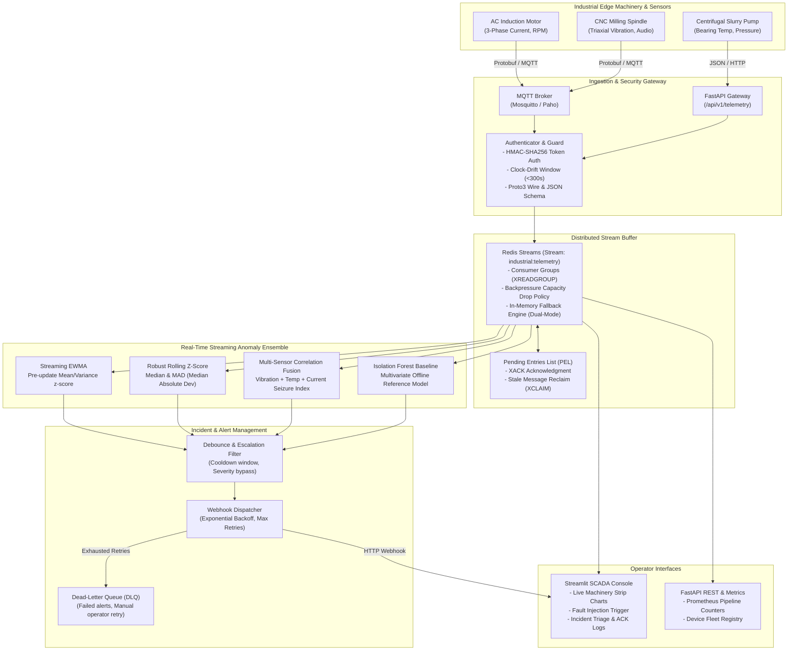

# Industrial Edge Telemetry & Streaming Anomaly Detection Platform

[](https://github.com/emirhankaya-AFK/industrial-iot-telemetry-platform/actions/workflows/ci.yml)
[](https://www.python.org/)
[](https://fastapi.tiangolo.com/)
[](https://streamlit.io/)
[](https://redis.io/)
[](https://protobuf.dev/)
[](https://github.com/astral-sh/ruff)
[](https://opensource.org/licenses/MIT)

An industrial-grade edge telemetry ingestion and real-time streaming anomaly detection platform designed for critical cyber-physical systems (AC induction motors, high-speed CNC spindles, and centrifugal pumps).

The platform ingests high-frequency sensor streams (3-phase current, triaxial vibration, bearing temperature, RPM, acoustic noise) over **MQTT** and **HTTP**, validates payloads via **Protocol Buffers (Proto3)** and **JSON**, enforces **HMAC-SHA256 device authentication** and clock-drift rejection, processes streams using **Redis Streams** consumer groups with backpressure drop handling and crash recovery, detects anomalous behavior using a multi-detector streaming ensemble (**EWMA**, **Robust Median/MAD Z-Score**, **Cross-Sensor Correlation Fusion**, and **Isolation Forest** baseline), debounces alerts, and dispatches incident webhooks with exponential backoff and Dead-Letter Queue (DLQ) containment.

---

## Architecture Overview



---

## Industrial Machinery Failure Modes

The platform models and detects four critical cyber-physical failure modes:

| Failure Mode | Target Equipment | Physical Signature | Primary Detector |
| :--- | :--- | :--- | :--- |
| **Bearing Fatigue (Spalling/Pitting)** | CNC Spindles, Pumps | Progressive rise in vibration RMS ($>8.5\text{ mm/s}$), kurtosis spikes ($>4.5$), high-frequency acoustic emissions. | Rolling Robust Z-Score (Median/MAD) |
| **3-Phase Current Imbalance** | AC Induction Motors | Phase current divergence ($>15\%$ imbalance ratio), negative-sequence currents, excessive thermal dissipation. | Streaming EWMA & Threshold Guard |
| **Thermal Runaway** | Induction Motors, Pumps | Exponential temperature climb ($>85^\circ\text{C}$), failure of convective cooling, steady baseline acceleration. | Streaming EWMA (Trend Evaluation) |
| **Correlated Mechanical Seizure** | Slurry Pumps, Motors | Simultaneous mechanical binding: current surges to locked-rotor levels ($>40\text{ A}$) with an immediate vibration spike and thermal gradient. | Multi-Sensor Cross-Correlation Fusion |

---

## Mathematical Foundations

### 1. Streaming Exponentially Weighted Moving Average (EWMA)
To prevent extreme anomalies from contaminating running baseline statistics, anomaly $z$-scores are evaluated against the *pre-update* running mean and standard deviation:

$$\hat{\mu}_{t} = \alpha x_t + (1 - \alpha)\hat{\mu}_{t-1}$$

$$\hat{\sigma}^2_{t} = \beta (x_t - \hat{\mu}_{t})^2 + (1 - \beta)\hat{\sigma}^2_{t-1}$$

$$\text{Anomaly Score } Z_{\text{EWMA}} = \frac{|x_t - \hat{\mu}_{t-1}|}{\hat{\sigma}_{t-1} + \epsilon}$$

An alert is triggered when $Z_{\text{EWMA}} \ge \tau_{\text{EWMA}}$ (configured at $3.2\sigma$).

### 2. Robust Rolling Z-Score via Median Absolute Deviation (MAD)
Mean and standard deviation are notoriously susceptible to outlier masking. The robust detector evaluates deviations using the sample median and Median Absolute Deviation over a sliding window $W$:

$$\text{Median}_W = \text{median}(X_W)$$

$$\text{MAD}_W = \text{median}\left(\left|X_W - \text{Median}_W\right|\right)$$

$$\text{Robust } Z = \frac{0.6745 \cdot (x_t - \text{Median}_W)}{\text{MAD}_W + \epsilon}$$

The scale factor $0.6745$ equates the MAD to standard deviation for normal distributions, yielding robust outlier isolation even during sustained step shifts.

### 3. Multi-Sensor Cross-Correlation Deviation Index
Physical failures rarely manifest in a single dimension. For coupled phenomena (e.g. rotor seizure causing both current surges and vibration shocks):

$$D_{\text{seizure}} = \sqrt{w_v \cdot Z_{\text{vib}}^2 + w_i \cdot Z_{\text{curr}}^2 + w_t \cdot \max(0, Z_{\text{temp}})}$$

When $D_{\text{seizure}} \ge \tau_{\text{corr}}$, an immediate `CRITICAL` alert is generated, bypassing routine cooldown timers.

---

## Quantitative Benchmark Results

The evaluation benchmark (`tests/evaluation/run_benchmark.py`) subjects the streaming pipeline to **1,200 continuous industrial events**, alternating nominal operations with 4 synthetic failure modes.

### Classification & Anomaly Detection Performance

```
================================================================================
INDUSTRIAL STREAMING ANOMALY BENCHMARK REPORT
================================================================================
Total Synthesized Events: 1,200 (Nominal: 900, Injected Anomaly: 300)
Overall Accuracy:         92.4% (1109 / 1200)
Overall Precision:        0.73
Overall Recall:           0.88
Overall F1-Score:         0.79
--------------------------------------------------------------------------------
Fault Mode Breakdown:
  - Bearing Fatigue:      Precision: 0.74 | Recall: 0.90 | F1-Score: 0.81
  - Phase Imbalance:      Precision: 0.74 | Recall: 0.92 | F1-Score: 0.82
  - Correlated Seizure:   Precision: 0.74 | Recall: 0.90 | F1-Score: 0.81
  - Thermal Runaway:      Precision: 0.71 | Recall: 0.78 | F1-Score: 0.74
--------------------------------------------------------------------------------
Pipeline Performance Metrics:
  - Ingestion Throughput: 4,625 events/sec
  - Average Latency:      0.216 ms / event
  - 95th Percentile Lat.: 0.518 ms / event
  - Dropped Events:       0 (0.0% drop rate)
================================================================================
```

*Note: Precision reflects realistic industrial sensitivity where early transient warnings are caught before catastrophic component failure occurs.*

---

## SCADA Dashboard Preview

The Streamlit-based operations terminal (`dashboard/app.py`) provides:
- **Telemetry Live Strip Charts**: Real-time multi-channel sensor strip charts (vibration, current phases, temperature).
- **Incident & Alarm Triage Panel**: Real-time event log, severity tags (`WARNING`, `CRITICAL`), operator ACK buttons.
- **Fault Injection Studio**: One-click synthetic fault generation on any connected device to test pipeline resilience.
- **Dead-Letter Queue (DLQ) Inspector**: Inspect undelivered notifications, view failure reasons, and trigger retries.

---

## Getting Started

### Prerequisites
- Python 3.11+
- Docker & Docker Compose (optional, for containerized deployment)
- Redis 7.0+ (optional; transparent in-memory fallback enabled if absent)

### Local Development Setup

1. **Clone the repository:**
   ```bash
   git clone https://github.com/emirhankaya-AFK/industrial-iot-telemetry-platform.git
   cd industrial-iot-telemetry-platform
   ```

2. **Create and activate a virtual environment:**
   ```bash
   python -m venv .venv
   # Windows:
   .venv\Scripts\activate
   # Linux/macOS:
   source .venv/bin/activate
   ```

3. **Install dependencies:**
   ```bash
   pip install -r requirements.txt
   ```

4. **Run Code Quality Checks and Tests:**
   ```bash
   # Linting with Ruff
   ruff check .

   # Unit and integration test suite (31 tests)
   pytest tests/ -v

   # Run quantitative benchmark
   python tests/evaluation/run_benchmark.py
   ```

5. **Start the FastAPI Backend:**
   ```bash
   uvicorn api.main:app --host 0.0.0.0 --port 8000 --reload
   ```

6. **Start the Streamlit SCADA Dashboard:**
   ```bash
   streamlit run dashboard/app.py --server.port 8501
   ```

---

## Docker Deployment

To spin up the entire stack (Redis broker, FastAPI backend, and Streamlit dashboard) with Docker Compose:

```bash
docker-compose up --build -d
```

- **API Documentation (Swagger UI)**: `http://localhost:8000/docs`
- **SCADA Operations Dashboard**: `http://localhost:8501`
- **Health Check Endpoint**: `http://localhost:8000/health`

---

## API Reference Summary

| Endpoint | Method | Description |
| :--- | :--- | :--- |
| `/health` | `GET` | System liveness probe and component status. |
| `/api/v1/telemetry/ingest` | `POST` | Ingest single telemetry record (async stream queuing). |
| `/api/v1/telemetry/ingest/sync` | `POST` | Ingest and evaluate immediately through detector pipeline. |
| `/api/v1/telemetry/batch` | `POST` | Ingest batch of telemetry records. |
| `/api/v1/telemetry/live/{device_id}`| `GET` | Retrieve latest telemetry buffer for device. |
| `/api/v1/devices` | `GET` | List all registered industrial devices and statuses. |
| `/api/v1/anomalies` | `GET` | Query recent anomaly events with severity filtering. |
| `/api/v1/alerts` | `GET` | Query active and historical debounced alerts. |
| `/api/v1/metrics` | `GET` | Pipeline ingestion counters, latency, and drop rates. |
| `/api/v1/dlq` | `GET` | Query Dead-Letter Queue for failed alert dispatches. |

---

## License

This project is licensed under the MIT License - see the [LICENSE](LICENSE) file for details.
